<h1 align="Center"> VWebapp</h1>

## Table of Content

* [Background](#back)
* [Tasks](#task)
    + [Creating Database](#database)
    + [Registration](#register)
    + [Update user](#update)
    + [Delete user](#delete)
    + [User Details](#details)
    + [Statistic](#stat)
* [Technical Specification - matplotlib](#tech)
    + [Line Graph](#line)
    + [Bar Graph](#bar)
    + [Histogram](#Histogram)
    + [Scatter Plot](#Scatter)
    + [Pie Chart](#pie)
* [Useful Links](#useful)

## <a name="back"></a> Background

This repository is an attempt to create web application using Python Flask module.

The following prerequisites are required: 

1. A website for local Temple Sri Venkataramana Temple Karkala <Br />
2. A Home page contains information on temple <Br />
3. Users can register themselves and see other registered users <Br />
4. Users can Change/update their information using their registration numbers. <Br />
5. Admin can Remove the User(Currently User can remove can themself.) <Br />
6. User can see their Information in User Details. <Br />
7. Statistical Informations on Users Details. <Br />
8. Contact Information of Temple 

The following Specifications has to be done: 

1. Flask webserver listening on localhost at certain specified port for user requests <Br />
2. Endpoints <Br />
    * / or /home - renders index.html, homepage of the temple with images and useful links <Br />
    * /register - user can register here  <Br />
        - GET method - form for registration gets displayed <Br />
	    - PUT/POST method - user values for registration will be accepted by server <Br />
    * /update <Br />
        - GET method - for changing user information of existing registered users, here a webpage must be rendered <Br />
        - POST method  -  user values to be sent to flask for updation <Br />
    * /delete <Br />
        - GET Method - a form for deleting user <Br />
        - POST method - user request must be sent to flask for deletion <Br />
    * /list - renders dynamic webpgae of list of registered users <Br />
    * /statistic <Br />
        - GET Method - a form for statistical informations on users details <Br />
        - POST method - user request must be sent to flask to generate graphs <Br />
    * /contact - renders contact.html, contact information of temple <Br />
    * /* - any other endpoints will display error.html <Br />

Persistence storage
   * The Registered User information will be stored in a database

Please Note, This website is created only for the purpose of learning.

## <a name="task"></a> Tasks

User needs to execute the python script  before doing the following and make sure that the webserver is running in background. <p>

### <a name="database"></a>1. Creating Database<br />
User can create the database using python script and do the manipulations (SQLITE3 CRUD operations) for the Endpoints <br />

### <a name="register"></a>2. Registration <br />

User can register with their details in registration form by click on "Register" Button on Home page or using "/register" Endpoint 
and these user details will be updated in Database <br />

 <br />
user needs to click on Register once after all informations are updated.
### <a name="update"></a>3. Update user <br />

User can update or change their information by click on "Update user" Button on Home page or using "/Update" Endpoint <br />

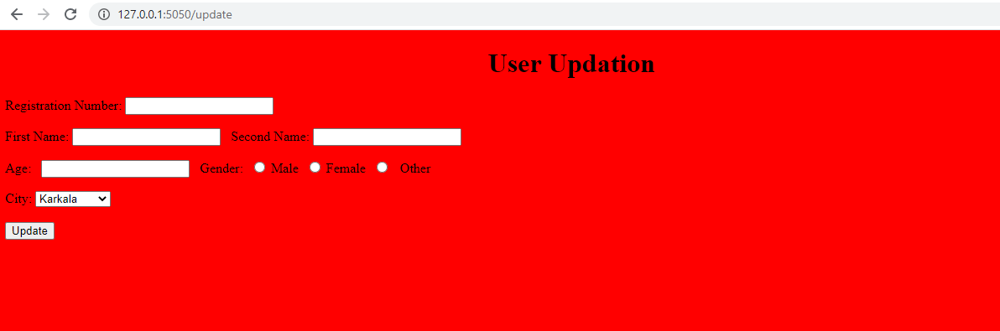 <br />
User can change their details, If they know their registration number. These Information can be seen by click "User Details" Button 
on Home page or using "/list" Endpoint <br />

### <a name="delete"></a>4. Delete user <br />

If Admin wants to delete any user, he can delete by click on "Remove user" Button on Home page or using "/delete" Endpoint <br />

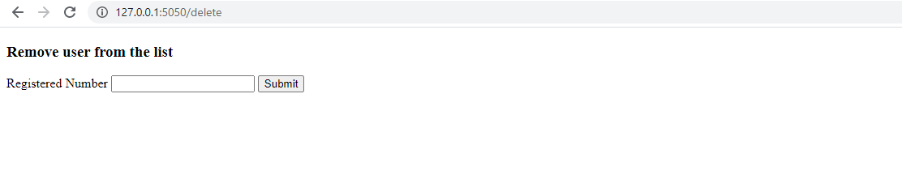 <br />
Please note, currently user having full access to delete any user and these can be changed.

### <a name="details"></a>5. User Details <br />

User can check their details by click on "User Details" Button on Home page or using "/list" Endpoint <br />

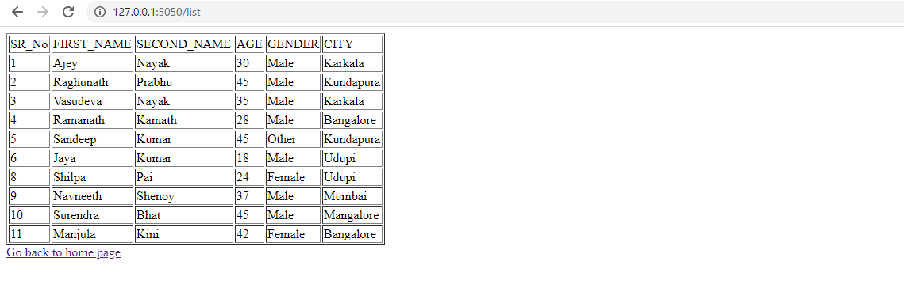 <br />
### <a name="stat"></a>6. Statistic <br />

User will get Statistical Information of user details by click on "Statistics" Button on Home page or using "/statistic" Endpoint <br />

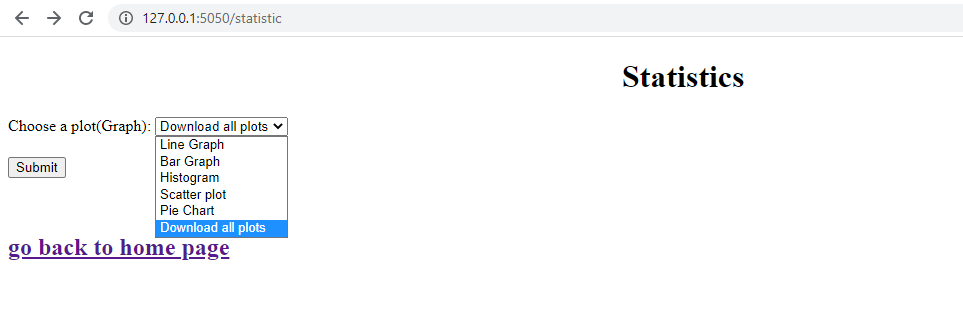 <br />
In this the datas from database will get converted to Python data structures and using this, we are going to plot different kind of 
graphs using the module Matplotlib for data analysis.<br />

Based on the python data structure, we have plotted 5 kind of graphs, which has follows: <br />

### 1. Line Graph

The line graph shows Employee count with respect to their Cities

### 2. Bar Graph

The bar graph shows Employee count with respect to their Second Names.

### 3. Histogram

In this section, we are plotting the graph based on User age with duration of 10 Years

### 4. Scatter Plot

The scatter graph shows the Age of Male and Female based on their Cities.

### 5. Pie Chart

In the Piechart, we can see the Percentagewise City of Users

### <a name="tech"></a>Technical Specification - MATPLOTLIB Module

Matplotlib is a graph plotting library in python that serves as a visualization utility.<br />
It is a comprehensive library for creating static, animated, and interactive visualizations in Python and It can also be used in python 
scripts, shell, web application servers and other graphical user interface toolkits.<br />

There are various plots which can be created using python matplotlib and basic codes in python matplotlib in order to generate a 
simple graph.

```python
from matplotlib import pyplot as plt

#Plotting to our canvas
plt.plot([1,2,3],[4,5,1])
#Showing what we plotted
plt.show()
```

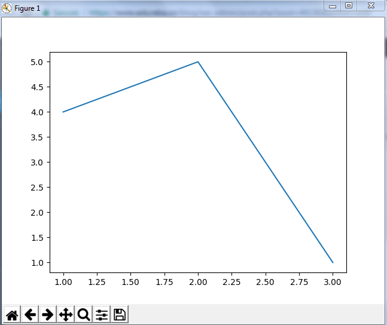

We can add title, labels to sample graph created by python matplotlib library to bring in more meaning to it.

```python
from matplotlib import pyplot as plt

x = [5,2,7]
y = [2,16,4]
plt.plot(x,y)
plt.title('Info')
plt.ylabel('Y axis')
plt.xlabel('X axis')
plt.show()
```

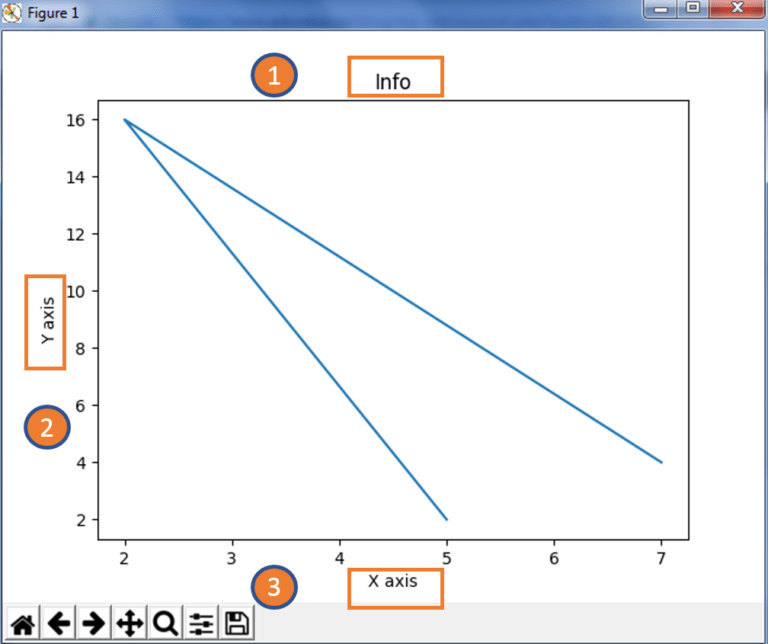

There are various plots which can be created using python matplotlib. Some of them are listed below:

### <a name="line"></a>1. Line Graph

A line graph is a type of chart used to show information that changes over time. We plot line graphs using several points connected by straight lines.
We also call it a line chart. The line graph comprises of two axes known as 'x' axis and 'y' axis. The horizontal axis is known as the x-axis.

Eg:
```python
from matplotlib import pyplot as plt
from matplotlib import style
 
style.use('ggplot')
x = [5,8,10]
y = [12,16,6]
x2 = [6,9,11]
y2 = [6,15,7]
plt.plot(x,y,'g',label='line one', linewidth=5)
plt.plot(x2,y2,'c',label='line two',linewidth=5)
plt.title('Epic Info')
plt.ylabel('Y axis')
plt.xlabel('X axis')
plt.legend()
plt.grid(True,color='k')
plt.show()
```

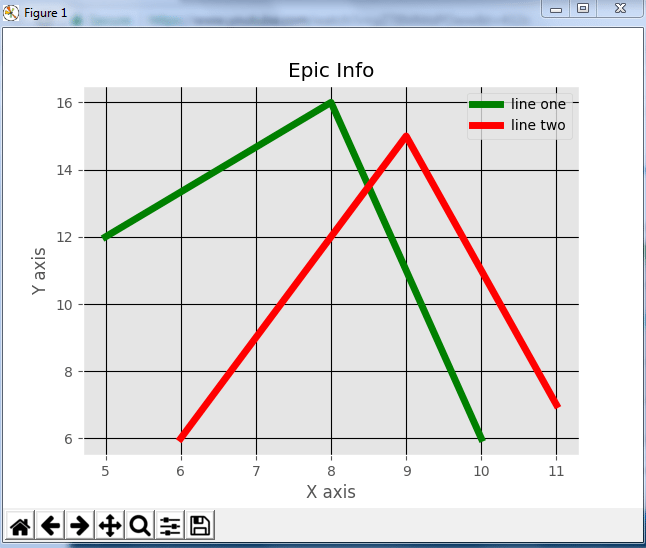 <br />


### <a name="bar"></a>2.Bar Graph

A bar graph uses bars to compare data among different categories. It is well suited when we want to measure the changes over a period of time. 
It can be represented horizontally or vertically. Also, the important thing to keep in mind is that longer the bar, greater is the value. 

Eg:
```python
from matplotlib import pyplot as plt
 
plt.bar([0.25,1.25,2.25,3.25,4.25],[50,40,70,80,20],
label="BMW",width=.5)
plt.bar([.75,1.75,2.75,3.75,4.75],[80,20,20,50,60],
label="Audi", color='r',width=.5)
plt.legend()
plt.xlabel('Days')
plt.ylabel('Distance (kms)')
plt.title('Information')
plt.show()
```


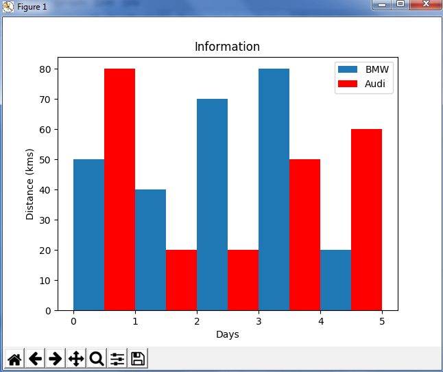 <br />
In the above plot, we can see the comparison between the distance covered by two cars BMW and Audi over a period of 5 days.

### <a name="Histogram"></a>3. Histogram

Histograms are used to show a distribution whereas a bar chart is used to compare different entities. Histograms are useful 
when we have arrays or a very long list.

Eg: 
```python
import matplotlib.pyplot as plt

population_age = [22,55,62,45,21,22,34,42,42,4,2,102,95,85,55,110,120,70,65,55,111,115,80,75,65,54,44,43,42,48]
bins = [0,10,20,30,40,50,60,70,80,90,100]
plt.hist(population_age, bins, histtype='bar', rwidth=0.8)
plt.xlabel('age groups')
plt.ylabel('Number of people')
plt.title('Histogram')
plt.show()
```

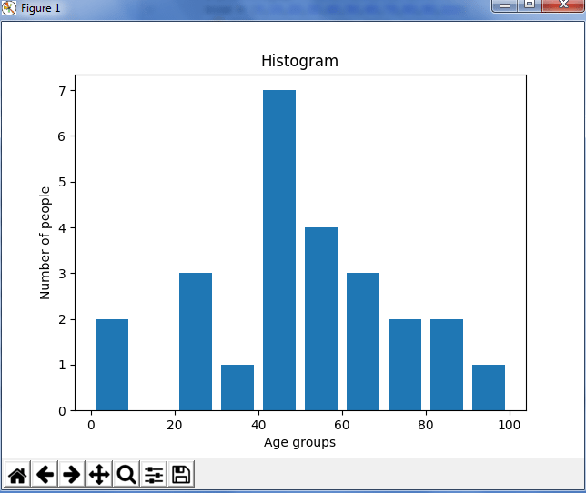 <br />
In the above plot,we can see the interval of 10 which means the first bin contains elements from 0 to 9, then 10 to 19 and so on.

### <a name="Scatter"></a>4. Scatter Plot

A scatter plot is a type of plot or mathematical diagram using Cartesian coordinates to display values for typically two variables for a set of data.

Eg:
```python
import matplotlib.pyplot as plt

x = [1,1.5,2,2.5,3,3.5,3.6]
y = [7.5,8,8.5,9,9.5,10,10.5]
 
x1=[8,8.5,9,9.5,10,10.5,11]
y1=[3,3.5,3.7,4,4.5,5,5.2]
 
plt.scatter(x,y, label='high income low saving',color='r')
plt.scatter(x1,y1,label='low income high savings',color='b')
plt.xlabel('saving*100')
plt.ylabel('income*1000')
plt.title('Scatter Plot')
plt.legend()
plt.show()
```

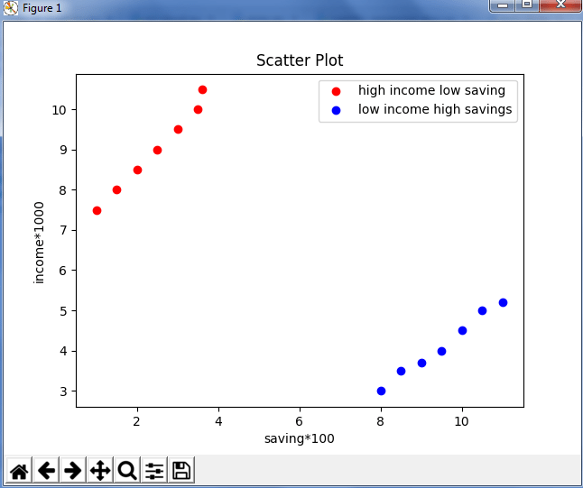<br />
The data is displayed as a collection of points having ‘high income low salary’ and ‘low income high salary’.


### <a name="pie"></a>6. Pie Chart
A pie chart refers to a circular graph which is broken down into segments i.e. slices of pie.
It is basically used to show the percentage or proportional data where each slice of pie represents a category

Eg:
```python
import matplotlib.pyplot as plt
 
days = [1,2,3,4,5]
 
sleeping =[7,8,6,11,7]
eating = [2,3,4,3,2]
working =[7,8,7,2,2]
playing = [8,5,7,8,13]
slices = [7,2,2,13]
activities = ['sleeping','eating','working','playing']
cols = ['c','m','r','b']
 
plt.pie(slices,
  labels=activities,
  colors=cols,
  startangle=90,
  shadow= True,
  explode=(0,0.1,0,0),
  autopct='%1.1f%%')
 
plt.title('Pie Plot')
plt.show()
```

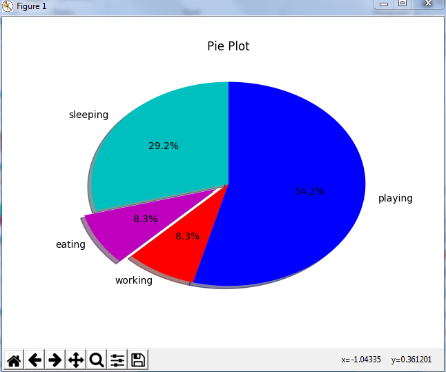 <br />

In the above pie chart, we have divided the circle into 4 sectors or slices which represents the respective category
(playing, sleeping, eating and working) along with the percentage they hold. Now, if we have noticed these slices
adds up to 24 hrs, but the calculation of pie slices is automatically done.

<h2>Key Take-aways </h2>

+ From this repository, User will get hands-on experience creation of database using SQLITE3 and CRUD operations. <Br />
+ User can learn various modules in Python such as Flask, Matplotlib etc.
+ User have a experience to generate static and dynamic webpages.
+ From Matplotlib module user can genearte and analyse statistical data.

## <a name="useful"></a> Userful Links

| **Sl. No.** | **Link** | **Remarks** |
----------|--------------|--------------
1| [SQLITE3](https://www.sqlite.org/)| SQLITE Tutorial |
2| [W3 Tutorial](https://www.w3schools.com/python/matplotlib_intro.asp)| W3 Tutorial |
3| [Matplotlib Tutorial](https://www.youtube.com/watch?v=yZTBMMdPOww) | Matplotlib Tutorial |